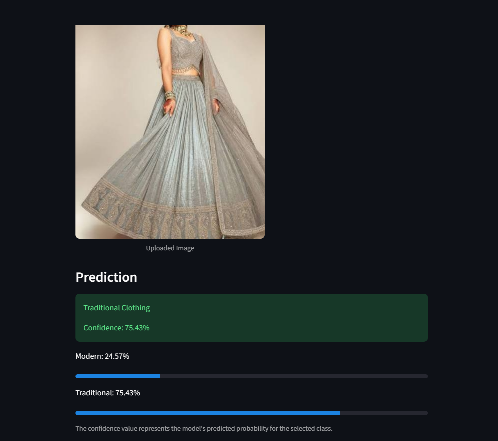
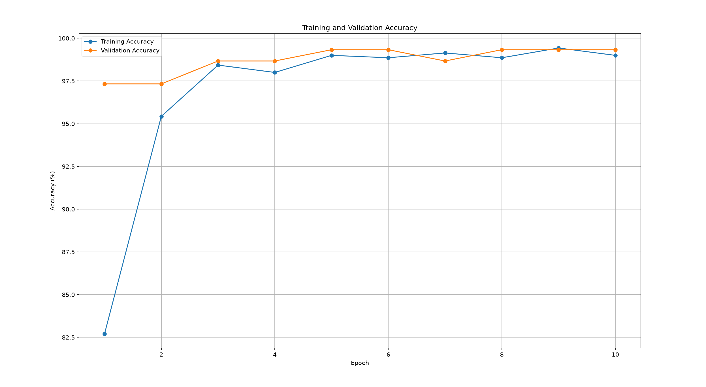
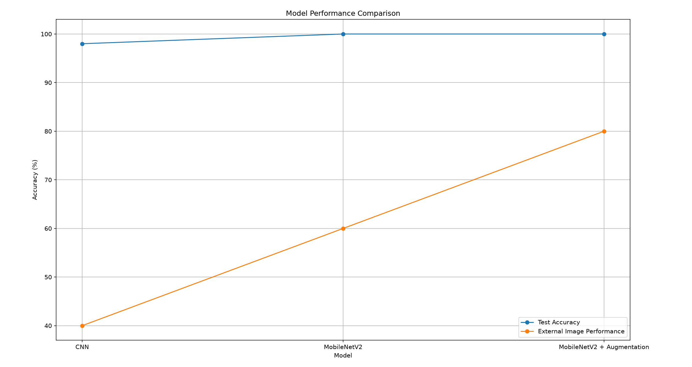

# A CNN Based Approach for Classifying Traditional and Modern Indo-Fashion Styles

## 📌 Project Overview

This project uses Deep Learning and Computer Vision to classify clothing images into two categories:

- Traditional Clothing
- Modern Clothing

The project uses a Convolutional Neural Network (CNN) and Transfer Learning with MobileNetV2.

A Streamlit web application is also developed so that a user can upload a clothing image and receive a prediction with the model's confidence.

---

## 🎯 Objective

The main objective of this project is to build an image classification system that can distinguish between traditional Indian fashion and modern clothing styles.

The project also explores how different deep learning approaches affect model performance and generalization.

---

## 🛠️ Technologies Used

- Python
- TensorFlow
- Keras
- MobileNetV2
- NumPy
- Pillow
- Scikit-learn
- Matplotlib
- Streamlit
- Git & GitHub

---

## 🧠 Models Used

Three approaches were experimented with:

### 1. Basic CNN

A CNN was built from scratch using:

- Conv2D
- MaxPooling2D
- Flatten
- Dense layers

### 2. MobileNetV2 Transfer Learning

MobileNetV2 pretrained on ImageNet was used as the base model.

The pretrained layers were frozen and a new classification layer was added for the two clothing classes.

### 3. MobileNetV2 with Data Augmentation

The final approach uses MobileNetV2 together with data augmentation techniques such as:

- Random horizontal flipping
- Random rotation
- Random zoom

This model was selected for the Streamlit application based on the experiments performed in this project.

---

## 📊 Dataset

The project uses two clothing datasets:

### Traditional Clothing

Images were selected from the IndoFashion dataset.

Selected categories include:

- Saree
- Lehenga
- Women Kurta
- Men's Kurta
- Sherwani
- Dhoti Pants
- Nehru Jacket
- Dupatta
- Petticoat

### Modern Clothing

Images were selected from the Clothing Dataset Full.

Selected categories include:

- T-Shirt
- Shirt
- Pants
- Shorts
- Skirt
- Outwear
- Dress
- Longsleeve
- Polo
- Hoodie
- Blazer

A subset of 500 traditional and 500 modern images was prepared for this project.

---

## 📂 Dataset Split

The 1000 selected images were divided into:

| Dataset | Traditional | Modern | Total |
|---|---:|---:|---:|
| Training | 350 | 350 | 700 |
| Validation | 75 | 75 | 150 |
| Testing | 75 | 75 | 150 |

---

## 🔄 Image Preprocessing

Images are:

1. Loaded from the dataset
2. Resized to `224 × 224`
3. Converted into NumPy arrays
4. Normalized from `0–255` to `0–1`

For the augmented model, training images also undergo random:

- Horizontal flipping
- Rotation
- Zoom

---

## 📈 Model Evaluation

The models were evaluated using a separate test dataset.

The results were:

| Model | Test Accuracy |
|---|---:|
| Basic CNN | 98% |
| MobileNetV2 | 100% |
| MobileNetV2 + Augmentation | 100% |

The final model also produced predictions on external images that were not part of the prepared dataset.

---

## 🌐 Streamlit Application

A Streamlit web application was developed for testing the trained model.

### Application workflow

```text
Upload Image
     ↓
Resize Image
     ↓
Normalize Image
     ↓
MobileNetV2 + Augmentation Model
     ↓
Prediction
     ↓
Modern / Traditional
     ↓
Confidence Score

## Project Screenshots

### Streamlit Application



### Training and Validation Accuracy



### Model Performance Comparison

